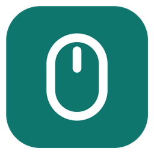
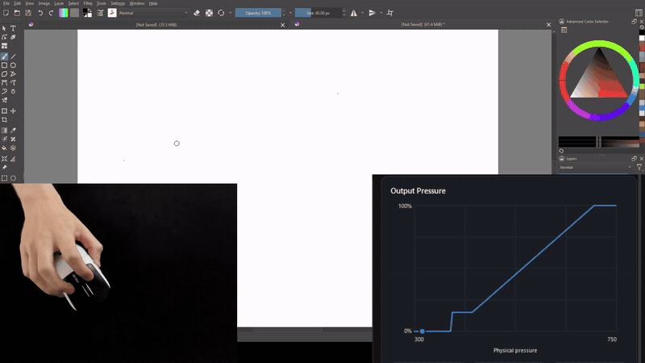
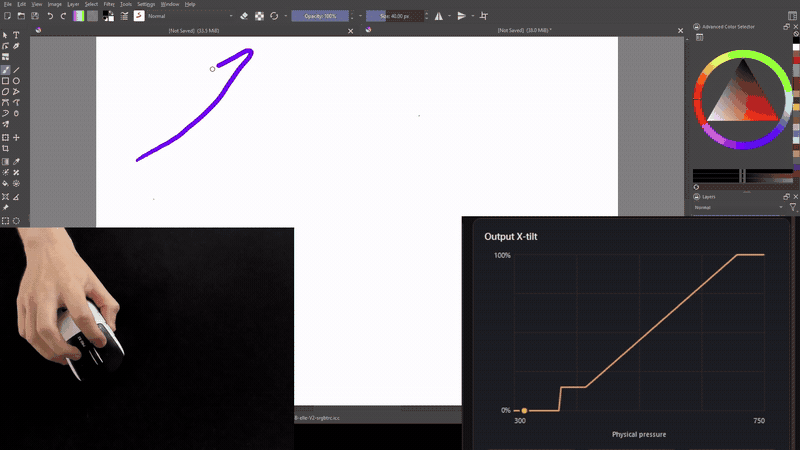
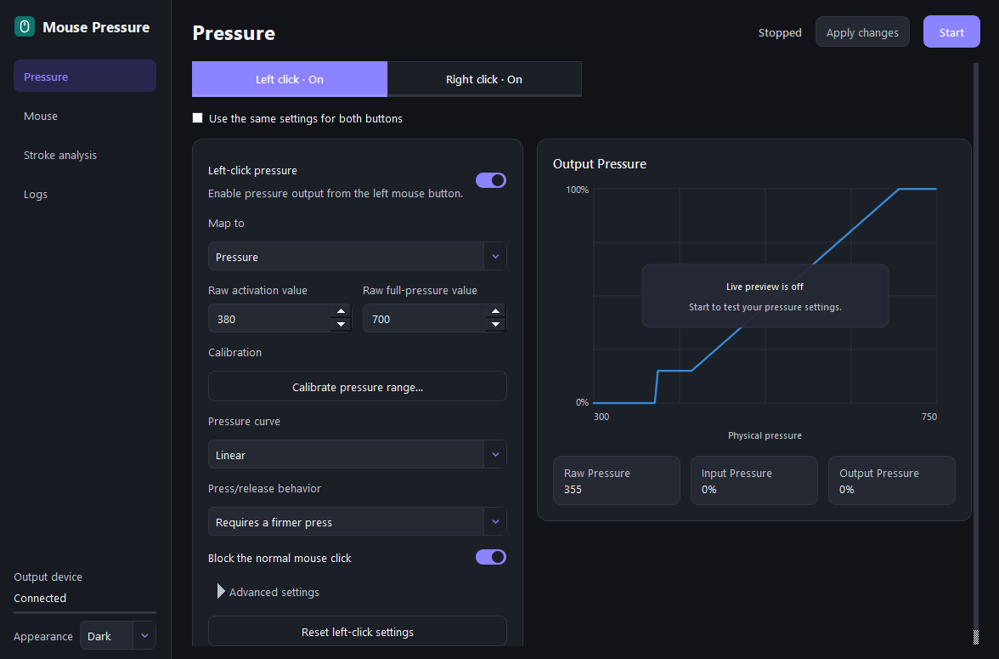
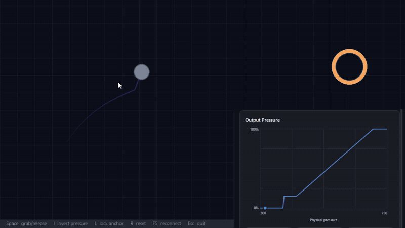

<div align="center">
  
  <h1>Mouse Pressure</h1>
  <p>Use analog mouse-button force as Windows Ink pressure and tilt.</p>

  <p>
    <a href="docs/compatibility.md"></a>
    <a href="docs/compatibility.md"></a>
    <a href="LICENSE"></a>
    <a href="docs/releasing.md"></a>
  </p>

  <p>
    <strong><a href="https://github.com/benmklein/Mouse-Pressure/releases">Download for Windows</a></strong>
    · <a href="docs/compatibility.md">Compatibility</a>
  </p>
</div>

The Logitech Superstrike has analog sensors in its left and right buttons.
Logitech's software uses those sensors to adjust click actuation. Mouse Pressure
uses them as continuous input.

Press lightly for low pen pressure. Press harder for more. Either button can
also control X-tilt, giving drawing applications a second analog value.

Mouse Pressure sends standard Windows Ink input and does not install a kernel
driver.

| Pressure-sensitive writing | Color control during a stroke |
|:---:|:---:|
| [](docs/media/pressure-writing.mp4) | [](docs/media/pressure-coloring.mp4) |
| Button force controls brush pressure. | Left pressure controls the stroke while right pressure controls hue. |

## What it does

- Reads both analog mouse buttons independently
- Sends pressure, X-tilt, Y-tilt, or rotation through Windows Ink
- Calibrates light and full presses for each button
- Applies adjustable response curves
- Includes a small physics sandbox for testing analog input

<p>
  
</p>

## Using both buttons

Both buttons can be mapped to different outputs, allowing you to control different continuous values at the same time.

Leave the left button mapped to **Pressure** and map the right button to
**X-tilt**, **Y-tilt**, or **Rotation**. In Krita, those pen sensors can control
hue, size, opacity, or rotation while the left button controls the stroke.

To configure it in Krita:

1. Open the Brush Editor with `F5`.
2. Select the brush property you want to control.
3. Choose the matching tilt or rotation sensor.

Other Windows Ink applications may expose similar controls.

## Games and experiments

[](docs/media/pressure-game.mp4)

Analog button force can control more than brushes. The driver includes a sandbox game (under the Mouse tab) that uses
pressure to extend and retract a chain.

Developers can use the Windows Ink inputs in their own pressure-sensitive mouse
games. A Godot plugin is planned to make those signals easier to use.

## Install

1. Download `MousePressure-<version>-Setup.exe` from
   [Releases](https://github.com/benmklein/Mouse-Pressure/releases).
2. Run the installer.
3. Connect a compatible mouse.
4. Open Mouse Pressure and select **Start**.
5. Choose a pressure-sensitive brush in your drawing application.

Photoshop uses Windows Ink by default.

For Krita:

1. Open **Settings → Configure Krita → Tablet Settings**.
2. Select **Windows 8+ Pointer Input**.
3. Restart Krita.

Use `Ctrl+F12` to start output. Use `Ctrl+Shift+F12` to force-stop it.

See [compatibility](docs/compatibility.md) for supported hardware and
applications.

## Alpha limitations

This is alpha software.

- Tested on Windows 10
- Windows 11 expected to work but not yet verified on physical hardware
- Unsigned installer may trigger Microsoft Defender SmartScreen
- First stroke after starting can occasionally appear as a dot
- Pressure behavior varies between applications and brush presets

See [compatibility](docs/compatibility.md) for the full support scope.

<details>
<summary><strong>Run from source</strong></summary>

```powershell
git clone https://github.com/benmklein/Mouse-Pressure.git
Set-Location Mouse-Pressure
py -m venv .venv
.\.venv\Scripts\python.exe -m pip install -e ".[dev,sandbox]"
.\.venv\Scripts\python.exe -m mouse_pressure.pyside_ui
```

Run the tests:

```powershell
.\.venv\Scripts\python.exe -m pytest
```

Build the Windows installer:

```powershell
.\scripts\build_windows.ps1
```

</details>

## License

Mouse Pressure is available under the [MIT License](LICENSE).

Also see [third-party notices](THIRD_PARTY_NOTICES.md),
[privacy](PRIVACY.md), [security](SECURITY.md), and
[recovery instructions](docs/recovery.md).
